# Projecto 1 - Sistema de Gestion Vehicular

## Interfaz grafica:

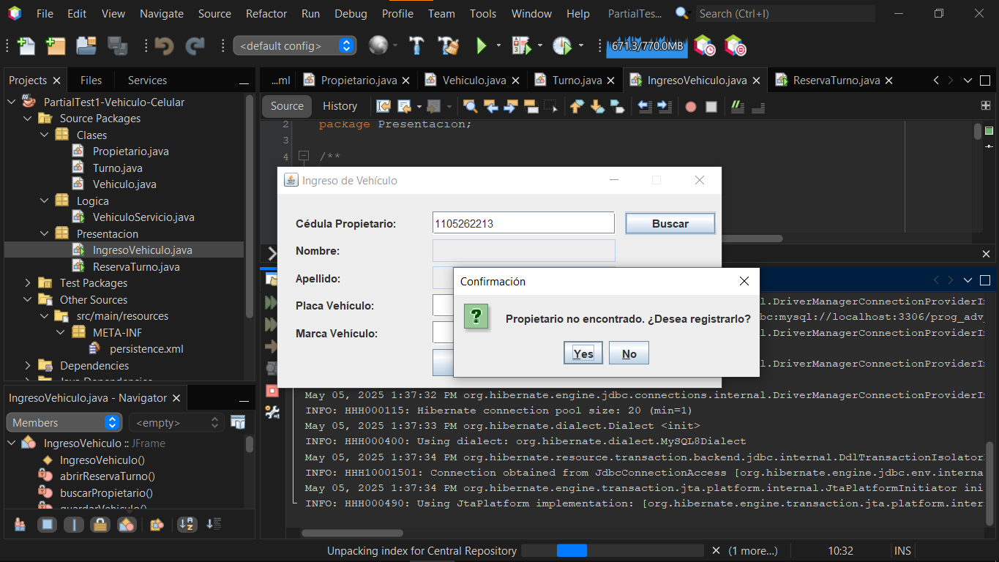

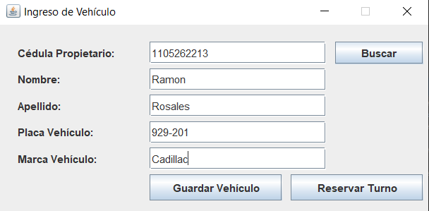

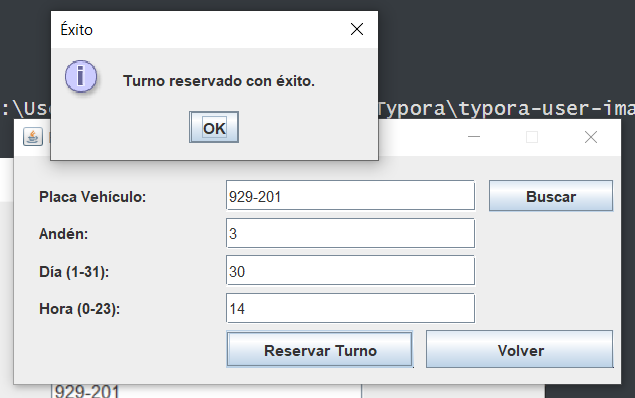

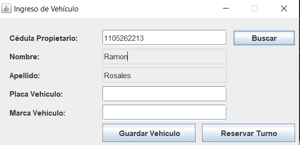

## Tablas Necesarias:

* Tres

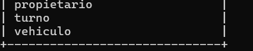

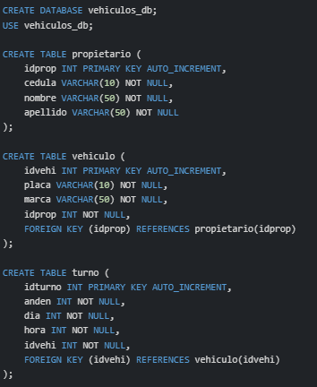

## Logica:

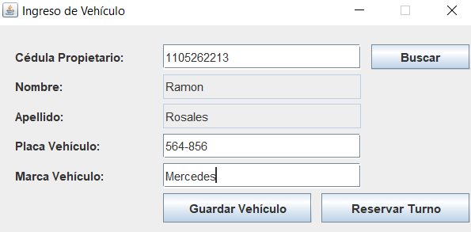

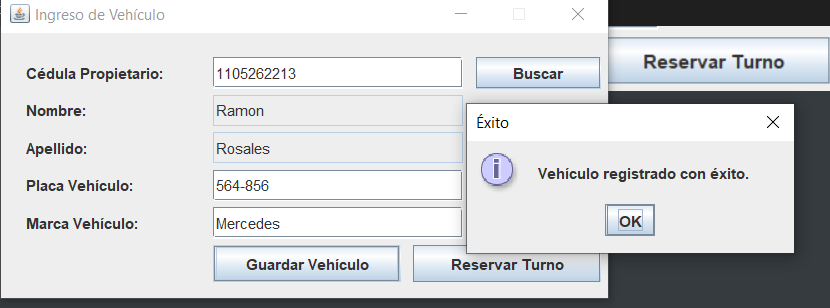

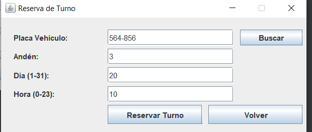

Si quiero registrar en el mismo anden:

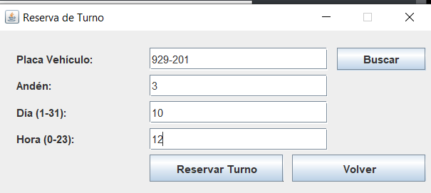

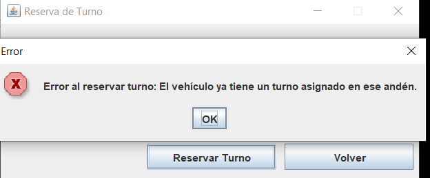

O en el mismo dia:

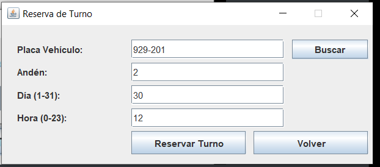

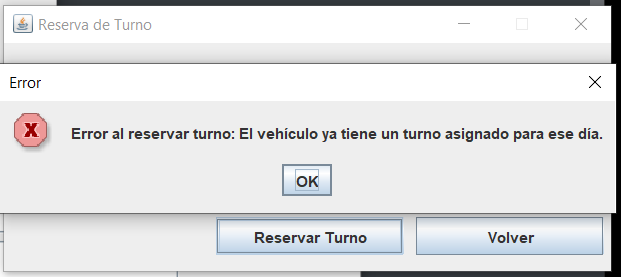

Como mostre previamente no sucede nada cuando se registra OTRO vehiculo en el mismo anden o el mismo dia

**Nota :** En este sistema la primera sentencia de verificacion en ejecutarse es el dia, luego se verifica el anden.

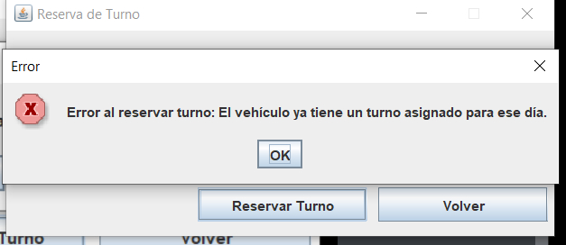 

## Archivos necesarios:

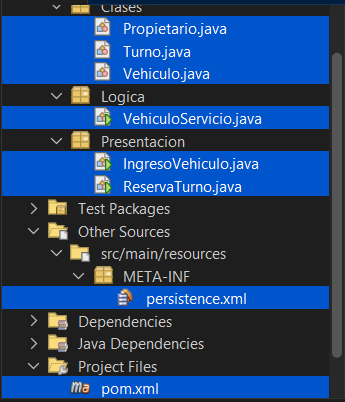

* pom.xml -> Donde llamamos las librerias que trabajaran en el projecto, como enlace de JPA usamos hibernate en lugar de Eclipse al ofrecernos ventajas como la creacion automatica de tablas.
* persistence.xml -> Nuestra unidad de persistencia donde establecemos el nombre de la unidad (ejm: Proyecto_PU), libreria de persistencia (Hibernate) y la conexion JDBC donde conectaremos todo nuestro proyecto hacia una base de datos con sus tablas automaticamente creadas gracias a Hibernate JPA
* Clases del paquete Presentacion -> Interfaces graficas mostradas (para registrar propietarios, vehiculos y reservar uno o mas  turnos para el mismo) 
* Clase del paquete Logica -> Logica de Verificacion del anden y el dia para cada vehiculo, en este paquete colocaremos mas clases de validacion y control de las reglas del negocio a futuro.
* Clases del paquete "Clases" (valga la redundancia) -> Entidades que se crearan como tablas en nuestra base de datos gracias a Hibernate JPA

## Resultado

### Tablas:

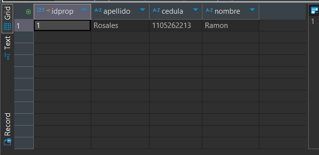

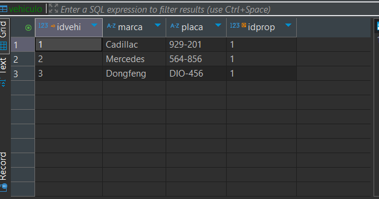

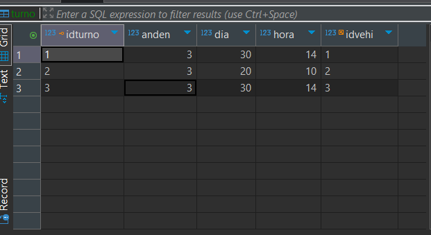

## FAQ:

* Se pueden registrar 2 vehiculos de un mismo propietario en el mismo anden, el mismo dia y la misma hora?

  > Si

  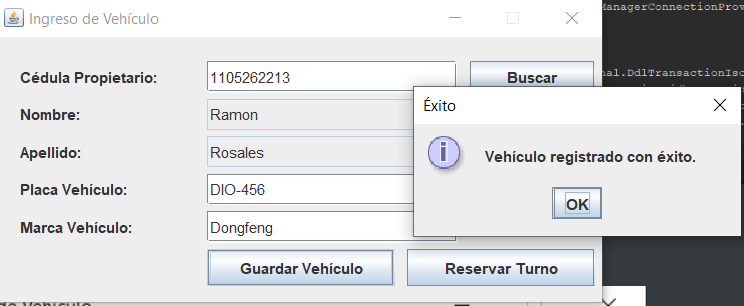

  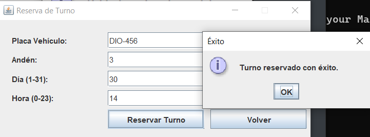

# Projecto 2 -> Sistema de Saldo de Celulares

## Interfaz grafica:

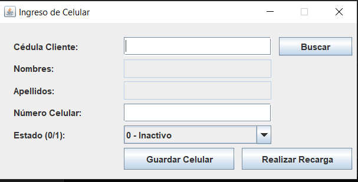

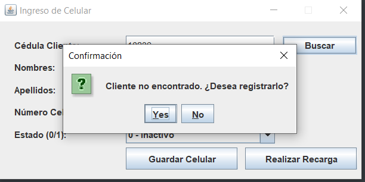

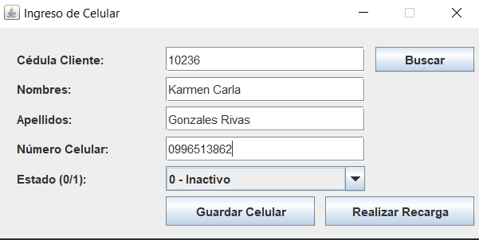

## Tablas:

* 3 :

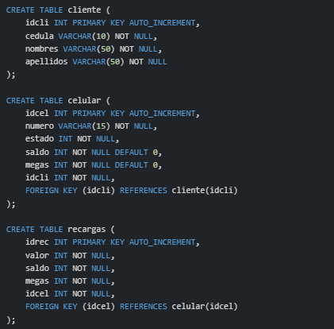

## Logica:

## Archivos necesarios:

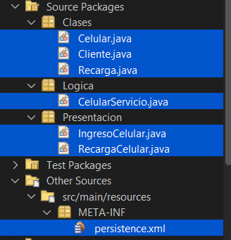

* Lo mismo que el anterior caso

## Resultado

# Autor:

* MRodzDirect